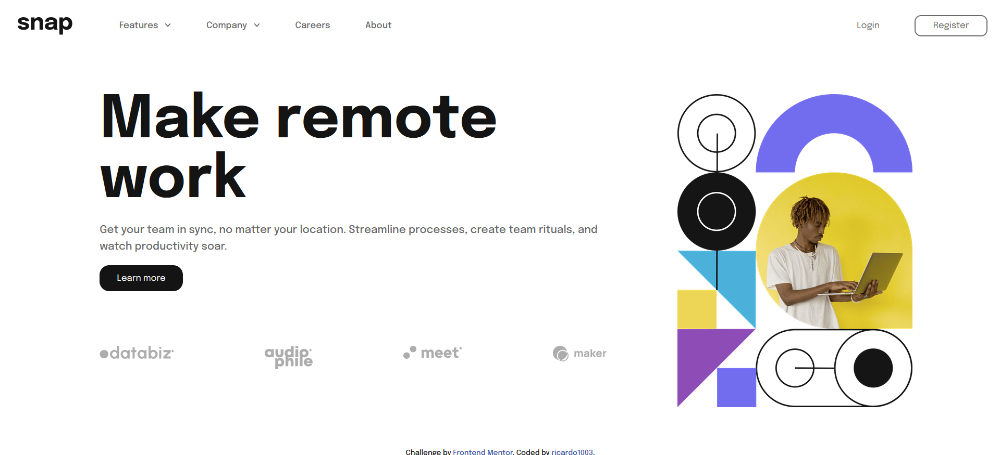

# Frontend Mentor - Intro section with dropdown navigation solution

This is a solution to the [Intro section with dropdown navigation challenge on Frontend Mentor](https://www.frontendmentor.io/challenges/intro-section-with-dropdown-navigation-ryaPetHE5). Frontend Mentor challenges help you improve your coding skills by building realistic projects. 

## Table of contents

- [Overview](#overview)
  - [The challenge](#the-challenge)
  - [Screenshot](#screenshot)
  - [Links](#links)
- [My process](#my-process)
  - [Built with](#built-with)
  - [What I learned](#what-i-learned)
  - [Continued development](#continued-development)
- [Author](#author)

## Overview

### The challenge

Users should be able to:

- View the relevant dropdown menus on desktop and mobile when interacting with the navigation links
- View the optimal layout for the content depending on their device's screen size
- See hover states for all interactive elements on the page

### Screenshot

### Links

- Solution URL: [Add solution URL here](https://www.frontendmentor.io/profile/ricardo1003)
- Live Site URL: [Add live site URL here](https://ricardo1003.github.io/Intro-section-with-dropdown-navigation/)

## My process

### Built with

- Semantic HTML5 markup
- CSS custom properties
- Flexbox
- Mobile-first workflow

### What I learned

I didn't learned much in this project, i have already done most of the things here before so I just remembered some topics that I have touched before. 

### Continued development

I want to continue focusing on animations, sometimes these challenges got some menus and that stuff, so I always try to add an animation to make it look better :)

## Author

- Website - [ricardo1003](https://ricardo1003.github.io/Intro-section-with-dropdown-navigation/)
- Frontend Mentor - [@ricardo1003](https://www.frontendmentor.io/profile/ricardo1003)
- Github - [@ricardo1003](https://www.Github.com/ricardo1003)